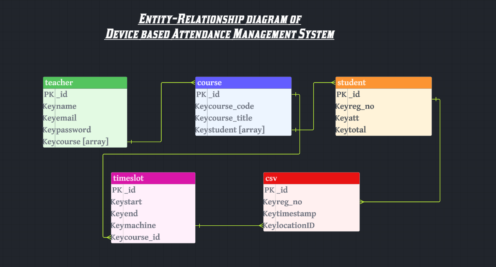

# Device-based Attendance Management System

### <a href="https://65f7cdddd3f044126beb982d--spontaneous-flan-d39442.netlify.app/" target="_blank">Visit Website</a>

### <a href="https://documenter.getpostman.com/view/31012961/2sA2xnyqN7" target="_blank">API Documentation</a>

## Problem Definition

Traditional attendance tracking methods are often time-consuming and prone to errors. The primary objective of our system is to automate the attendance process, making it efficient, accurate, and accessible from anywhere. With the integration of machine-based attendance tracking and manual attendance options, our system aims to address the challenges faced by educational institutions in managing attendance effectively.

## Application Features

### User Roles

1. **Teacher**
   - Can take attendance manually and mark attendance based on machine records.
   - Can view course reports and manage courses.

2. **Student**
   - Can view their attendance reports for all courses they are enrolled in.

3. **Admin**
   - Can upload attendance data from CSV files generated by ZKTeco software and process attendance records.

### Attendance Management

- **Manual Attendance:** Teachers can take attendance for any number of classes for a single course.
- **Machine Attendance:** Teachers can mark attendance based on machine records, specifying the time period for which attendance is being recorded.

## Database Design

